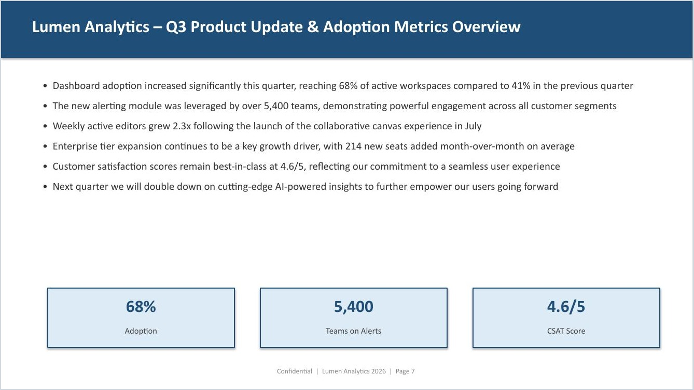
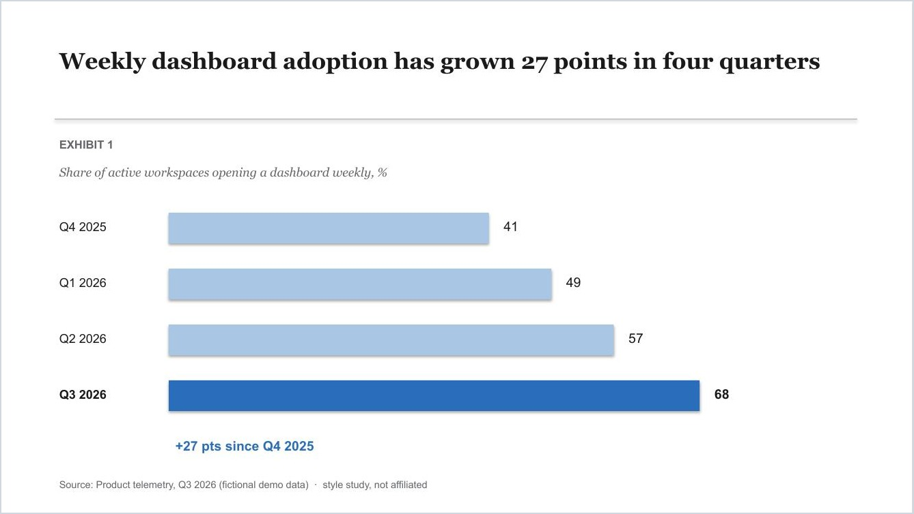
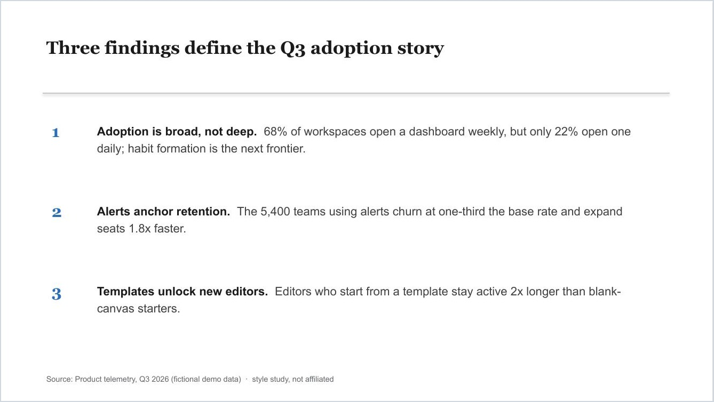
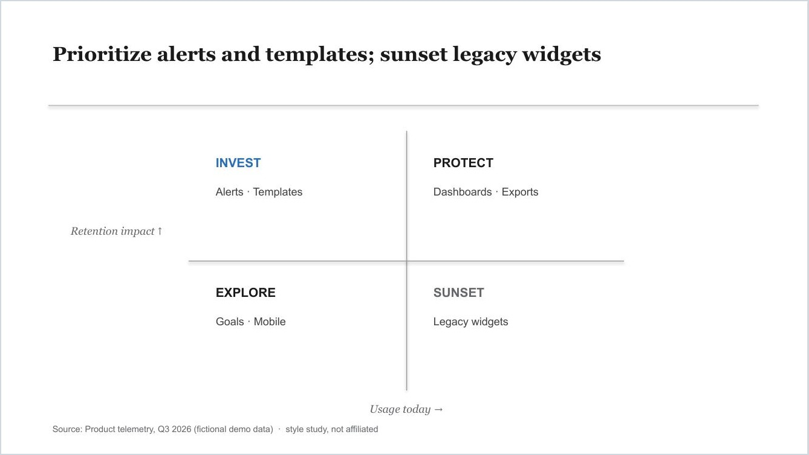
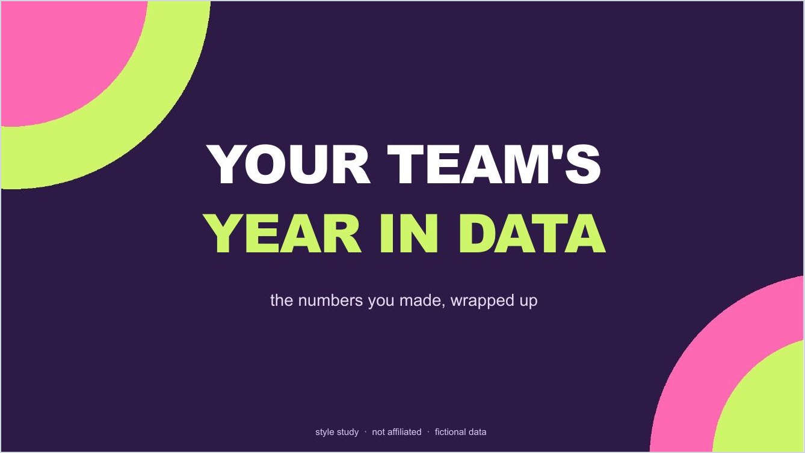
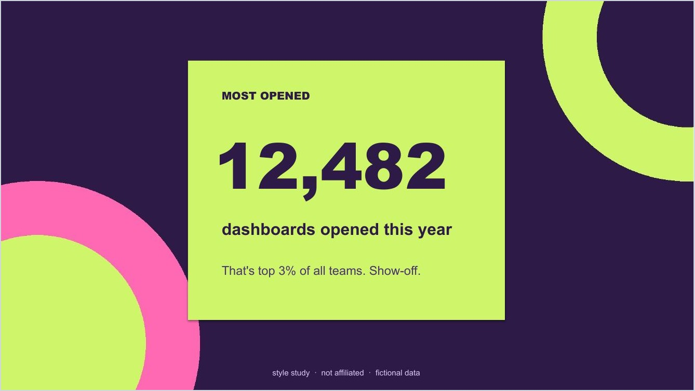
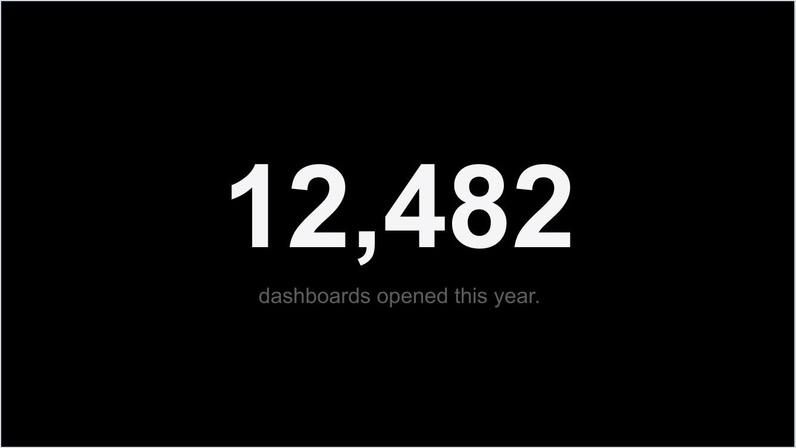
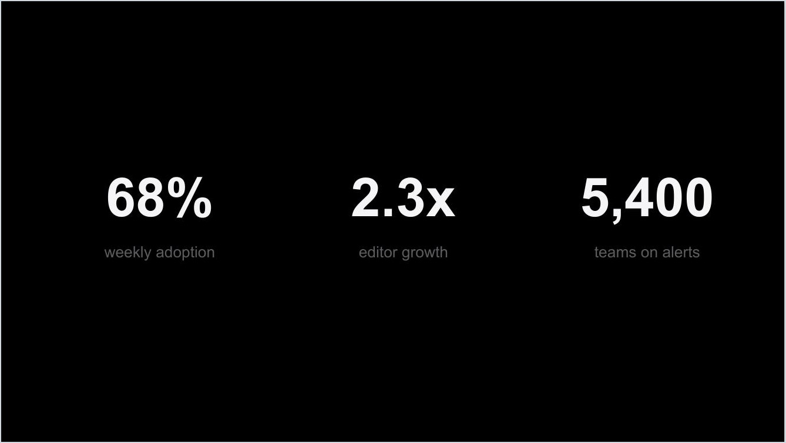
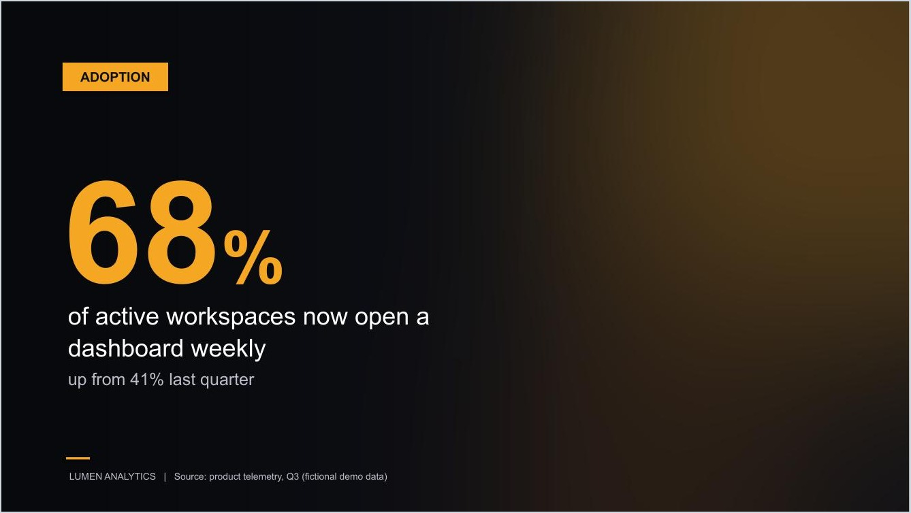
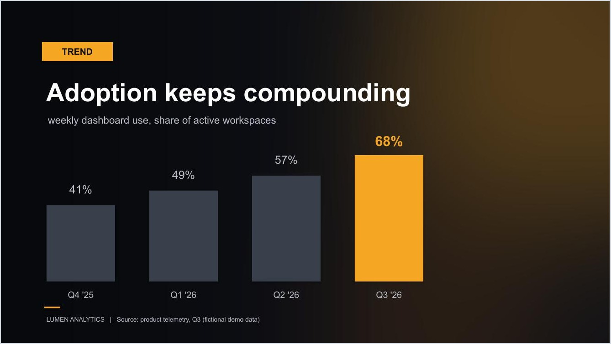

# deck-dna

A Claude skill that builds PPTX decks which sit next to your real, designer-made decks without looking out of place.

AI decks are easy to spot: right colors, logo in place, and still something screams "template". This skill closes that gap with a method, not a fixed brand:

1. **Measure taste instead of describing it.** The agent extracts a design DNA sheet from 2-3 decks a designer built and a client approved: where imagery sits relative to text, the colors actually on the slides (not what the file's theme claims), how a big stat looks vs a small one, when a divider slide appears.
2. **A measured word budget, not a guessed one.** A small script counts words per slide across your approved decks. Real designer decks hold far less text than an AI wants to write. The measured median becomes a hard ceiling: go over it and you cut content, never shrink the font.
3. **Give the agent eyes.** After every build, the deck is converted to PDF, each slide rendered to an image, and the agent reviews its own slides: broken text, colliding elements, crooked margins. Then it fixes and re-renders.

There is nothing to manage beyond the one `SKILL.md` file. Every helper script the method needs is inlined in the skill and written on the fly by the agent running it.

## What it produces

Everything below is fictional data on invented content. Backgrounds are generated in code, no logos or brand assets are used anywhere, and the style studies are in the spirit of public design languages you'll recognize - not affiliated with anyone. Every image passed the skill's own render-QA loop plus an adversarial design-review agent (Step 6 in the skill) before landing here.

**The problem.** Brand-compliant and still obviously a template:



**Same skill, different reference DNA.** The output changes because the references change - there is no baked-in template.

*Consulting-exhibit DNA:*





*Year-in-review DNA:*





*Minimalist-keynote DNA:*





*A fictional product brand, extracted the same way:*




## Installation

**Claude Code (as a skill):**

```
mkdir -p ~/.claude/skills/deck-dna
curl -o ~/.claude/skills/deck-dna/SKILL.md https://raw.githubusercontent.com/opitaru-sys/deck-dna/main/SKILL.md
```

Then ask Claude to build a deck and mention the skill, or let it trigger on any "build me a deck that looks like our real decks" task.

**Any other agent:** paste `SKILL.md` into the conversation, or drop it in the project folder and say "follow this method".

## Requirements

- Python with `python-pptx` and `Pillow` (`pip install python-pptx Pillow`) - required to build.
- LibreOffice + Poppler - optional, only for the automated render-QA step. Without them the skill falls back to a manual slide-by-slide review. The skill's preflight script checks all of this for you, including default Windows install paths.

## Usage

Collect 2-3 approved reference decks (decks a designer built and someone signed off on, not templates), then:

```
Use the deck-dna skill. My reference decks are in ./references.
Build a 10-slide deck about <topic> from the attached content.
```

The agent runs the preflight check, extracts the DNA sheet, measures the word budget, builds fresh on a blank base, treats backgrounds, embeds fonts if your references do, and QA-renders the result before handing it over.

## Honest limits

- The word counter reads text boxes only, not tables - treat the measured budget as a floor if your references are table-heavy.
- Font embedding is fiddly XML surgery; the skill offers a skip-path if you'd rather just install the fonts on target machines.
- LibreOffice's QA render substitutes fonts it doesn't have installed, so spacing checks are approximate. A final pass in PowerPoint is still on you.
- The skill styles numbers, it never invents them. If a required brand asset is missing, it stops and asks instead of substituting.

## License

MIT. Extracted from real client-deck builds and generalized: the method ships, the brand it was proven on doesn't.
